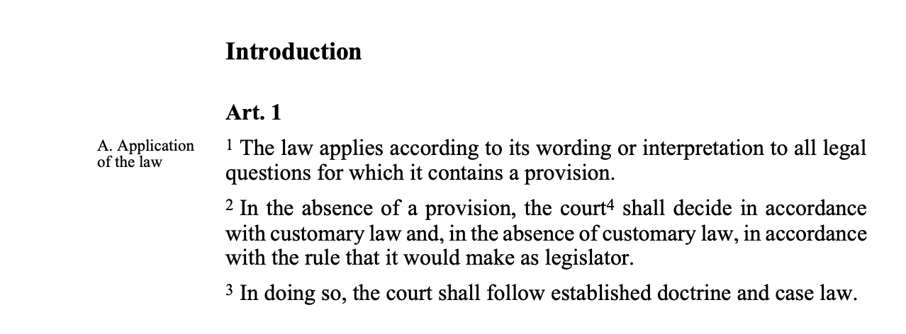

Recently, Retrieval-Augmented Generation (RAG) has emerged as a prominent approach that leverages large language models for building applications. However, in practical industrial settings, the primary bottleneck for the performance of RAG, particularly in terms of document retrieval, often lies not in the embedding model’s capabilities, but in the prior data ingestion pipeline. Building a RAG system begins with indexing documents, which are often in PDF format. This process typically starts with the use of PDF parsers or Optical Character Recognition (OCR) systems to extract text from the document's pages.


<!-- Recently, the new model [ColPali](https://arxiv.org/html/2407.01449v2) has attracte a lot of attention, for its use of a vision-language model to extract information for retrieval purposes. This approach demonstrates that leveraging recent Vision Language Models can produce high-quality, contextualized embeddings directly from images of document pages. -->

When a (machine-generated) PDF contains mostly text, the most straightforward way to extract the information is by using a Python package. There are various PDF extraction tools available on the market. Some useful open-source Python packages, like PDFPlumber and PyPDF, are very handy, while some companies offer paid solutions with more advanced capabilities. In this discussion, I will compare different two free PDF extraction packages, highlighting their advantages and disadvantages.


## pdfplumber vs pypdf 

[pdfplumber](https://github.com/jsvine/pdfplumber) is built on [`pdfminer.six`](https://github.com/goulu/pdfminer), enabling many customizable functions. This package can extract pages and text while preserving the layout. Additionally, it can identify the coordinates of words, allowing for the extraction of text within specific areas.

On the other hand, [pypdf](https://pypi.org/project/pypdf/) also allows for text extraction while maintaining the layout. You can use visitor functions to control which parts of a page you want to process and extract. However, it does not support extracting the coordinates of words.

The following example compares the extraction results of pdfplumber and pypdf using a PDF excerpt from the [Swiss Civil Code](https://www.fedlex.admin.ch/eli/cc/24/233_245_233/en). The PDF page presents a high level of complexity, with text that is discontinuously arranged and interspersed with numerous footnotes.

 


With this you can generate visualizations like:





```pypdf
var_dump('hello');
```





```pdfplumber
console.log("hello");
```






## Connect with RAG Framework 





```langchain
hello:
  - "whatsup"
  - "hi"
```





```Llama
{
  "hello": ["whatsup", "hi"]
}
```





## Benchemarking pdf extractors for RAG





Regular text





> A quote





Hipster list

- brunch
- fixie
- raybans
- messenger bag




